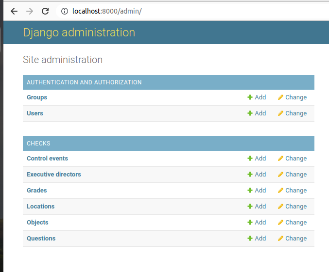
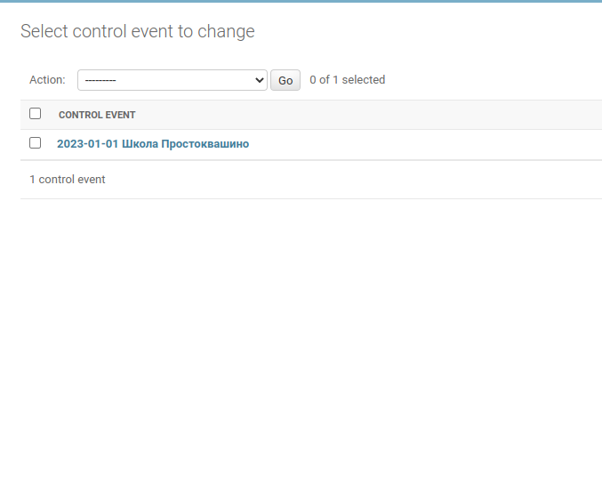
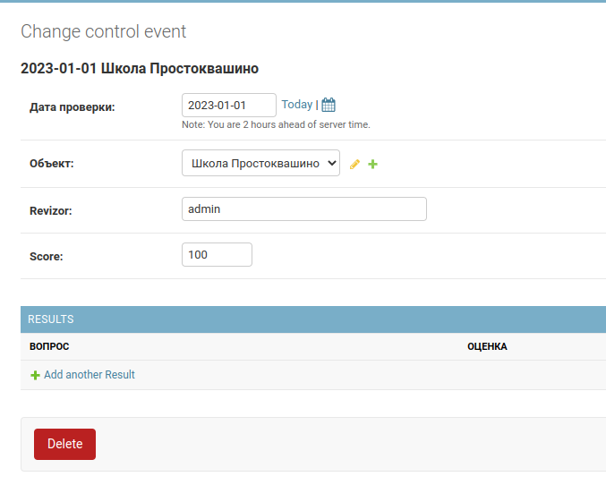

# Public-Catering-Check

## Запуск

* `git clone https://github.com/Votchitsev/Public-Catering-Check.git`
* `cd Public-Catering-Check`
* в директории `check_list` создать файл `secret_key.txt` в который записать секретный ключ.
* `make build`
* `make run`

Приложение доступно на `http://localhost:8000`
 
## Некоторая информация для пользователей
Здесь по идее должна быть полная инструкция по использованию данного приложения. Поскольку с основным функционалом вы знакомы я решил, что буду публиковать здесь разъяснения по функционалу, который вас интересует (по которым вы задали вопросы). 

**Вопросы задавайте** в телеграме - **@votchitsev** или в разделе **issue** данного репозитория на GitHub. Также, вы можете написать мне свои пожелания по улучшению функционала приложения. Это могут быть изменение или добаление какой-либо бизнес логики, изменение интерфеса, что угодно вплоть до цвета кнопки. **Мне очень важно получать обратную связь от вас!**

## Резервная копия базы данных

Перед началом любых манипуляций с кодом приложения, или изменением сущностей в административном разделе, рекомендую делать резервную копию базы данных. В приложении используется база данных **sqlite**. База данных запакована в один файл, который находится в директории проекта `data/db.sqlite3`. Копируем этот файл и помещаем его в безопасное место. После этого можно проводить любые манипуляции. Данные вы уже не потеряете точно. Настоятельно рекомендую делать бэкап почаще, хотябы раз в неделю... "на всякий слуйчай".

## Удаление проверки

Удалить проверку можно в административном разделе приложения. Для того, чтобы попасть туда необходимо к адресу приложения добавить `/admin/` и ввести логин и пароль администратора. По умолчанию логин - **admin**, пароль - **admin**. Дальше находим таблицу или сущность (как вам удобно) **Control events**. 

Заходим и ищем нужную проверку по дате и объекту. У меня на примере одна проверка, у вас их много. 

В открывшемся окне внизу жмём красную кнопку **delete**

Дальше вас спросят уверены ли вы. Вы соглашаетесь - проверка удалена!
